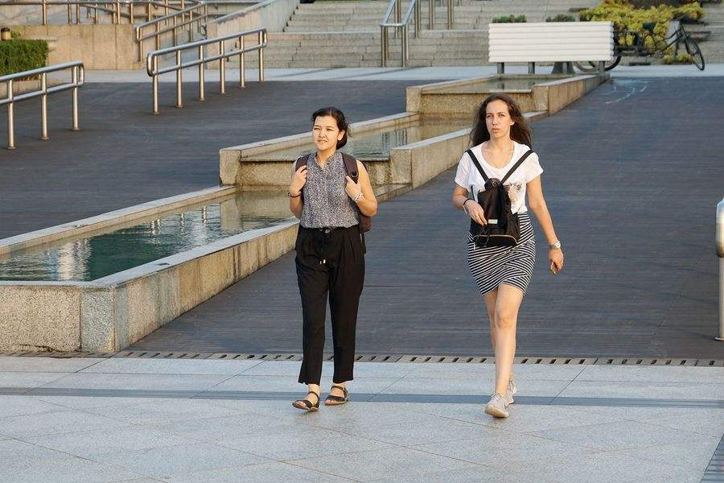
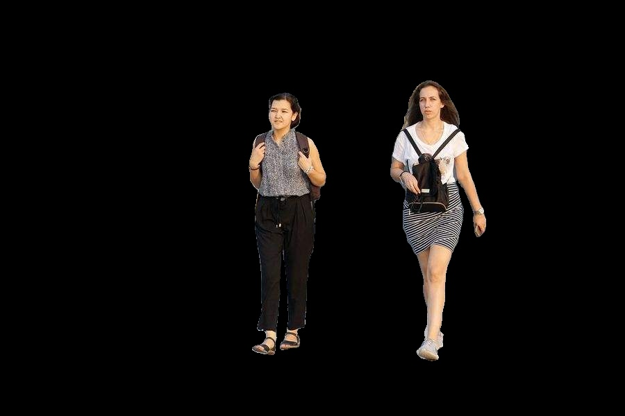

### 1.介绍
此工程是使用Libtorch实现的deeplabv3+的人像分割算法，其中deeplabv3+的backbone使用mobilenetV2。

### 2.依赖
- ubuntu 18.04
- CUDA 10.0
- cudnn 7.6.5
- Libtorch 1.6.0
- opencv

### 3.编译
- 下载Libtorch
```shell
weget https://download.pytorch.org/libtorch/cu101/libtorch-cxx11-abi-shared-with-deps-1.6.0%2Bcu101.zip
unzip libtorch-cxx11-abi-shared-with-deps-1.6.0.zip
cp libtorch root/third_party
```

- 编译可执行文件
```shell
mkdir build && cd build
cmake .. && make
```

- 运行
```shell
./person path/to/model_path path/to/image_path path/to/save_path
```

### 4.实验结果
|原图|结果图|
|----|----|
|||
|----|----|
|||